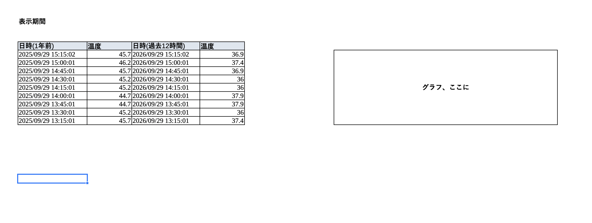

# ラズパイの温度DB管理
できること
記録、取得用のAPI提供
画面に指定した期間の数値とグラフ表示

## 使用技術
- python3
- django
- sqlite
- uv
  - 待ち受けport: 8181
- chart.js
- dockerは使用しない

## 画面
1画面のみ。ログイン不要。
デフォルト表示

### 表示項目
- 過去12時間分の月日時分と温度
- 1年前の上記と同じ月日時分と温度
- 折れ線グラフ

### カスタマイズ（未実装）
- 表示期間の指定(TBD)

## API
### Create  - 記録用API
POSTで登録する
{
  "dt": "",
  "temp": "",
}

### # Read - 取得用API
count: 何件取得するか

## データベース
テーブル temps

カラム名、カラムタイプ、コメント
dt, datetime, 記録日時
temp, decimal(4,1), 温度

---

ここから下はメモ。

マイグレーション

## その1
既存のスプシをcsv保存
csvの２カラムしか読まないように指示をしてseederを作成する

## その2
既存の温度検測プログラムの向き先とデータ形式を変更する

やること
uv で自動実行するようにuser serviceにする。
